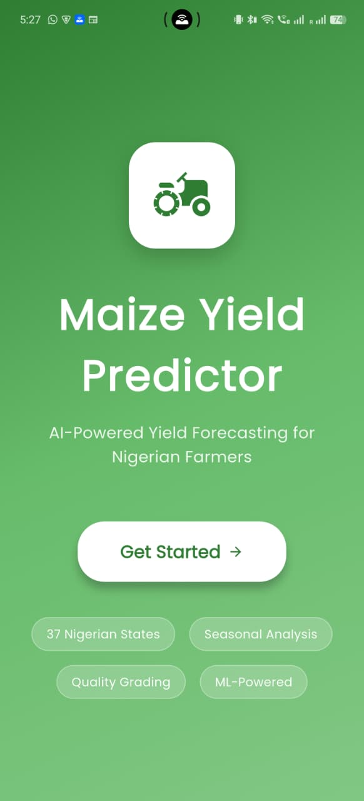
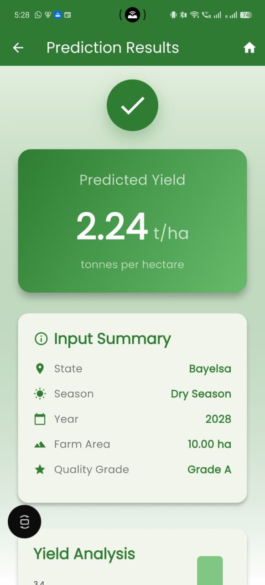
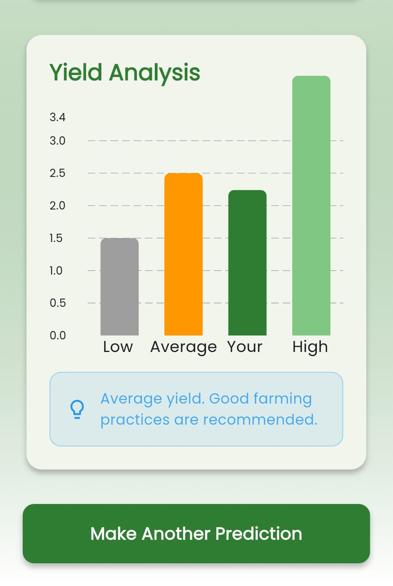

# Nigerian Maize Yield Prediction System

## Mission & Problem Statement

Africa's 280 million undernourished people and maize yields 60% below global standards threaten SDG 2 (Zero Hunger). My mission is to empower 50+ million smallholder farmers with technology-driven agricultural practice, enabling data-informed decisions that optimize resources and reduce climate-induced crop failures by 35%, advancing sustainable agricultural growth and food security across the continent.

## 🖁 Mobile App Showcase

<div align="center">
  
### Beautiful, Professional Mobile Interface

<table>
<tr>
<td width="33%">
  
  <p align="center"><b>Home Screen</b><br/>Clean welcome interface with app branding</p>
</td>
<td width="33%">
  
  <p align="center"><b>Prediction Form</b><br/>Intuitive input fields with validation</p>
</td>
<td width="33%">
  
  <p align="center"><b>Results Screen</b><br/>Clear yield display with visualization</p>
</td>
</tr>
<tr>
<td colspan="3">
  
  <p align="center"><b>Interactive Yield Analysis</b><br/>Compare your farm's yield against benchmarks</p>
</td>
</tr>
</table>

**Key Features:**
- 37 Nigerian States Coverage
- Seasonal Analysis (Wet/Dry)
- Real-time ML Predictions
- 📈 Visual Yield Comparisons
- Modern Material Design 3 UI
- Professional Green Agricultural Theme

</div>

---

## Public API Endpoint

**Swagger UI (Live Testing)**: [https://ml-mobileapp-linear-regression.onrender.com/docs](https://ml-mobileapp-linear-regression.onrender.com/docs)

**Base URL**: `https://ml-mobileapp-linear-regression.onrender.com`

## Video Demonstration

**YouTube Demo**: [Watch 5-Minute Walkthrough](https://youtu.be/PsY4venVtxM)

*Complete demonstration of model training, API testing with Swagger UI, and mobile app usage on Android device.*

---

## Mobile App Installation

### Prerequisites
- Flutter SDK 3.0 or higher
- Android Studio / VS Code with Flutter extensions
- Android device or emulator (Android 5.0+)

### Installation Steps

1. **Clone the repository**
   ```bash
   git clone https://github.com/YOUR_USERNAME/YOUR_REPO_NAME.git
   cd YOUR_REPO_NAME/mobile_app
   ```

2. **Install dependencies**
   ```bash
   flutter pub get
   ```

3. **Configure API endpoint**
   - Open `lib/config/api_config.dart`
   - Update `baseUrl` with your deployed API URL:
     ```dart
     static const String baseUrl = 'https://your-app.onrender.com';
     ```

4. **Run the app**
   ```bash
   # For Android
   flutter run
   
   # For iOS (macOS only)
   flutter run -d ios
   ```

5. **Build APK (Android)**
   ```bash
   flutter build apk --release
   ```
   APK location: `build/app/outputs/flutter-apk/app-release.apk`

### Using the Mobile App

1. Launch the app on your device
2. Select your Nigerian state from the dropdown
3. Choose season type (Wet/Dry)
4. Enter farm area in hectares
5. Select quality grade (A, B, or C)
6. Enter cultivation year
7. Tap "Predict Yield" to get instant results
8. View predicted yield in tonnes/hectare with visualization

---

## Project Structure

```
.
├── maize_yield_prediction.ipynb    # Model training notebook
├── API/
│   ├── main.py                     # FastAPI application
│   └── requirements.txt            # Python dependencies
├── best_model.pkl                  # Trained Random Forest model
├── scaler.pkl                      # Feature scaler
├── le_state.pkl                    # State label encoder
├── le_grade.pkl                    # Quality grade label encoder
└── feature_names.pkl               # Feature order for predictions
```

## Dataset

- **Source**: Nigerian Crop Yields Dataset
- **Records**: 17,516 maize cultivation records
- **Coverage**: 37 Nigerian states across multiple years
- **Features**: Geographic location, seasonal patterns, farm area, quality grades
- **Target**: Yield in tonnes per hectare

## Model Details

### Algorithm
Random Forest Regressor with 100 estimators

### Features
- `state`: Nigerian state (encoded)
- `area_ha`: Farm area in hectares
- `quality_grade`: Quality classification (Grade A, B, or C)
- `is_wet`: Binary indicator for wet season (1) or dry season (0)
- `year`: Cultivation year
- `area_wet_interaction`: Interaction term (area × season)

### Performance
- **R² Score**: 0.2372
- **MSE**: 0.3713
- **Training samples**: 14,012
- **Test samples**: 3,504

## Installation

### Prerequisites
- Python 3.8 or higher
- pip package manager

### Install Dependencies

```bash
# API deployment
cd API
pip install -r requirements.txt
```

### Dependencies
- fastapi>=0.104.1
- uvicorn[standard]>=0.24.0
- pydantic>=2.5.0
- joblib>=1.3.2
- scikit-learn>=1.4.0
- pandas>=2.1.3
- numpy>=1.26.2

## Running the API

### Local Development

```bash
cd API
uvicorn main:app --reload
```

The API will be available at:
- **Base URL**: http://127.0.0.1:8000
- **Interactive Docs**: http://127.0.0.1:8000/docs
- **Alternative Docs**: http://127.0.0.1:8000/redoc

### Production Deployment

The API is configured for deployment on Render.com or similar platforms.

**Build Command**:
```bash
pip install -r API/requirements.txt
```

**Start Command**:
```bash
cd API && uvicorn main:app --host 0.0.0.0 --port $PORT
```

## API Endpoints

### Core Endpoints

#### POST /predict
Predict maize yield for a single farm.

**Request**:
```json
{
  "state": "Abia",
  "season": "wet",
  "year": 2020,
  "area_ha": 5.0,
  "quality_grade": "Grade A"
}
```

**Response**:
```json
{
  "predicted_yield": 2.28,
  "input_parameters": {
    "state": "Abia",
    "season": "wet",
    "year": 2020,
    "area_ha": 5.0,
    "quality_grade": "Grade A"
  },
  "model_used": "Random Forest",
  "unit": "tonnes/hectare"
}
```

#### POST /predict/batch
Predict yields for multiple farms in one request.

**Request**:
```json
[
  {
    "state": "Abia",
    "season": "wet",
    "year": 2020,
    "area_ha": 5.0,
    "quality_grade": "Grade A"
  },
  {
    "state": "Kano",
    "season": "dry",
    "year": 2021,
    "area_ha": 10.0,
    "quality_grade": "Grade B"
  }
]
```

### Information Endpoints

#### GET /states
Returns list of all 37 Nigerian states available in the model.

**Response**:
```json
{
  "count": 37,
  "states": ["Abia", "Adamawa", "Akwa Ibom", ...]
}
```

#### GET /grades
Returns available quality grade classifications.

**Response**:
```json
{
  "count": 3,
  "grades": ["Grade A", "Grade B", "Grade C"]
}
```

#### GET /health
Health check endpoint for monitoring.

**Response**:
```json
{
  "status": "healthy",
  "model_loaded": true,
  "available_states": 37,
  "available_grades": 3
}
```

#### GET /
Root endpoint with API information.

## Input Validation

The API enforces strict validation on all inputs:

| Parameter | Type | Constraints |
|-----------|------|-------------|
| state | string | Must be one of 37 valid Nigerian states |
| season | string | Must be "wet" or "dry" (case-insensitive) |
| year | integer | Between 2000 and 2030 (inclusive) |
| area_ha | float | Greater than 0, maximum 1000 hectares |
| quality_grade | string | Must be "Grade A", "Grade B", or "Grade C" |

## Features

- ✅ RESTful API with POST and GET endpoints
- ✅ CORS middleware enabled for cross-origin requests
- ✅ Automatic request/response validation with Pydantic
- ✅ Interactive Swagger UI documentation
- ✅ Batch prediction support
- ✅ Comprehensive error handling
- ✅ Health check monitoring
- ✅ Type hints throughout codebase

## Model Training

The model was trained using the Jupyter notebook `maize_yield_prediction.ipynb` which includes:

1. Exploratory Data Analysis (EDA)
2. Feature Engineering
3. Model Training (Linear Regression, Decision Tree, Random Forest)
4. Model Evaluation and Selection
5. Model Persistence

To retrain the model, open and run all cells in the notebook.

## Example Usage

### Python

```python
import requests

url = "http://127.0.0.1:8000/predict"
data = {
    "state": "Abia",
    "season": "wet",
    "year": 2020,
    "area_ha": 5.0,
    "quality_grade": "Grade A"
}

response = requests.post(url, json=data)
print(response.json())
```

### cURL

```bash
curl -X POST "http://127.0.0.1:8000/predict" \
  -H "Content-Type: application/json" \
  -d '{
    "state": "Abia",
    "season": "wet",
    "year": 2020,
    "area_ha": 5.0,
    "quality_grade": "Grade A"
  }'
```

### JavaScript

```javascript
const response = await fetch('http://127.0.0.1:8000/predict', {
  method: 'POST',
  headers: {
    'Content-Type': 'application/json',
  },
  body: JSON.stringify({
    state: 'Abia',
    season: 'wet',
    year: 2020,
    area_ha: 5.0,
    quality_grade: 'Grade A'
  })
});

const result = await response.json();
console.log(result);
```

## Available States

Abia, Adamawa, Akwa Ibom, Anambra, Bauchi, Bayelsa, Benue, Borno, Cross River, Delta, Ebonyi, Edo, Ekiti, Enugu, Gombe, Imo, Jigawa, Kaduna, Kano, Katsina, Kebbi, Kogi, Kwara, Lagos, Nasarawa, Niger, Ogun, Ondo, Osun, Oyo, Plateau, Rivers, Sokoto, Taraba, Yobe, Zamfara, FCT

## Error Handling

The API returns appropriate HTTP status codes:

- **200**: Successful prediction
- **422**: Validation error (invalid input)
- **500**: Server error (model prediction failed)

Example error response:
```json
{
  "detail": "State 'InvalidState' not recognized. Available states: Abia, Adamawa, Akwa Ibom..."
}
```

## License

This project is provided as-is for educational purposes.
